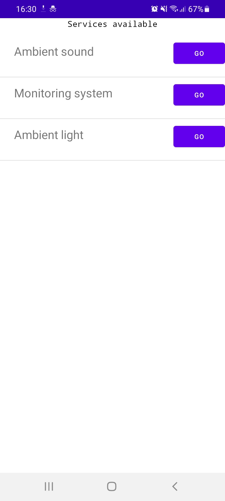

# Authenti6 applications

The Authenti6 Android application communicates with its backend to seamlessly authenticate and request
all web services available in the location the user is at.

Before use, we recommend deploying at least one backend infrastructure first, then build the Android application.

## 1. Backend

Before starting any backend application, go to `backend/` directory, create a python virtual environment 
and install requirements as shown below:

```
cd backend
python3 -m venv venv
source venv/bin/activate
pip install --upgrade pip
pip install -r requirements.txt
```

From now on, always use this virtual environment with `source venv/bin/activate` before running python programs.

### 1.1 Starting the Redis database

```
docker run -d --name redis --rm -p 6379:6379 -i -t redis:3.2.5-alpine
```

### 1.2 Starting the authentication-manager

```
cd backend/auth-manager
python3 auth.py
```

### 1.3 Starting the ipv6-agent

Because the ipv6-agent performs really low level network operations, it was implemented
in C and might require some skills with that programming language. 

The ipv6-agent **only works in Linux** and requires that your machine can **create a WiFi hostspot**.

First, go to its directory:

```
cd backend/agent
```

Then install some dependencies and build the ipv6-agent using the `make` command:

```
sudo apt update && sudo apt install -y libssl-dev libpcap-dev
make clean all
```

If the previous step succeeds, you are almost ready to start the ipv6-agent.
Now, create a WiFi hostpot on your machine and edit the IFACE variable of the `Makefile` with the name of 
the interface used as a WiFi hotpost.

You can gather this information by running `ip addr` and seeing what interface has a valid IP address ending with ".1".
For example: "10.42.0.1"

Finally, start the ipv6-agent running:

```
make run
```


### 1.4 Starting the services-provider

In the directory of the services-provider there is a JSON file with the IP
address of all services available. Change those IP addresses to the address of
your hotspot interface.

Then, start the service as below:

```
cd backend/services-provider
FLASK_ENV=development flask run -p 5050 -h 0.0.0.0 --cert=adhoc
```

### 1.5 Start the Monitoring System service:
We added a few samples of services that can be served to users. The simplest one is the
Monitoring System Service, which can be started as follows:

```
cd backend/services/ambient-sound
FLASK_ENV=development flask run -p 5052 -h 0.0.0.0
```

NOTE: If you want to start the Ambient Sound service, please contact Jefferson Cavalcante
at jeff.cav@alu.ufc.br for further instructions because that service needs Spotify Developer 
Credentials to be configured prior to its execution.

## 2 Android Application

Currently our Android application has the address of the `services-provider` set in a resource XML, so 
we recommend first editing the file `android-app/app/src/main/res/values/addresses.xml` with the address obtained
in section 1.3.

Then run the application and install it in some Android device.
Connect your smartphone to the hostpot you created in step 1.3 and start the app.

If you see a message indicating authentication failed, please close the app and open it again. Currently,
the authentication failed state is final. In further versions of our app we will add means for the restart
of the state machine.

If everything goes fine, you will be presented a list of available services with clickable buttons that opens the service
on the browser of your smartphone as shown below.


